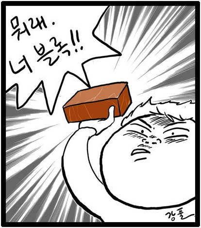

<!--### 동작 상태: **OFF, 자세한 상태는 [여기](https://twitter.com/search?f=tweets&q=%23%ED%8C%94%EB%A1%9C%ED%95%98%EC%A7%80%EB%A7%88%20from%3Apotato_jkw&src=typd)서 확인하세요!**
-->

<!---->

### **'팔로하지마' 서비스 종료**

### 소개
**프로필 자기소개문** 에 **내가 지정한 단어** 가 있는 사람은  
**팔로우** 했을 때 **블락/블언블** 을 면치 못할 것이다!

일정 시간마다 팔로워(요청자 포함)의 프로필 자기소개문을 확인해,  
내가 지정한 단어가 포함돼 있으면 자동 블락/블언블합니다.  
**내가 팔로우 하는 사람은 블락/블언블 되지 않습니다.**  
'맞팔 100%', '일탈' 찾는 계정은 이제 안녕!

<!--아래 버튼을 클릭해 지금 사용해보세요!

-->

<!--### 문의/건의사항 등
<a href="https://twitter.com/intent/tweet?screen_name=potato_jkw&text=%23%ED%8C%94%EB%A1%9C%ED%95%98%EC%A7%80%EB%A7%88%20" class="twitter-mention-button" data-lang="ko" data-size="large" data-related="potato_jkw" data-dnt="true">Tweet to @potato_jkw</a>

홍보도 부탁드려요!  
<a href="https://twitter.com/share" class="twitter-share-button" data-url="https://chokipoki.github.io/do-not-follow/" data-text="팔로하지마 beta로 원치 않는 사람의 팔로우를 막아보세요!" data-lang="ko" data-hashtags="팔로하지마" data-dnt="true" data-size="large">트윗하기</a>

### 개선 예정
- 블락 처리한 유저 목록
- 계정 이름 체크 기능(On/Off 가능)
- 많은 유저가 사용하는 단어 목록 체크박스로 사용할 수 있도록 제공
- 블락 처리하지 않을 유저 화이트 리스트

### 사용해보기
-->

### 업데이트 내역
- 2017-06-06: 작동 방식(블락, 블언블) 선택 기능
- 2017-06-05: (프로텍트 계정) 팔로워 요청자 확인 후 자동 블락, (내부) 작동 속도 3배 이상 향상
- 2017-06-04: 베타 오픈
